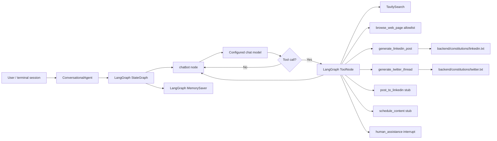

# AgentGovernance

A Python LangGraph content assistant that demonstrates a small governance layer around agent tool use: some proposed actions are blocked deterministically, some are stubs, and explicit human help requests interrupt the agent flow before continuing.

## Problem

AI agents can propose actions that should not always execute automatically. In this repository the agent can search the web, browse pages, generate platform-specific content, simulate scheduling, and attempt a LinkedIn posting workflow. Those actions have different risk profiles:

- Reading arbitrary URLs can expose the system to untrusted network destinations.
- Publishing content to an external platform should not be treated the same as drafting content.
- Some requests need human judgment instead of a fully automated response.

The codebase is not a production governance service. It is a compact Python implementation that shows where governance decisions can be inserted into an agent workflow.

## Solution

The agent uses LangGraph to route messages between an LLM-backed chatbot node and a tool node. Governance is implemented directly in tool definitions and graph control flow:

- `browse_web_page` validates URLs and only allows `example.com` and `wikipedia.org` before making an HTTP request.
- `post_to_linkedin` is intentionally a stub; it checks for credentials but does not call the LinkedIn API.
- `human_assistance` uses LangGraph `interrupt` so the graph can pause when the assistant asks for human help.
- Platform-specific content generation loads local "constitution" files and derives defaults for tone and structure instead of asking the user for those preferences every time.

This is middleware-like governance inside the agent runtime rather than a separate Express/Node service.

## Architecture



Implemented components:

- **Backend / runtime:** Python CLI entry point in `backend/chatbot.py`.
- **Policy enforcement:** Deterministic checks are embedded in tool functions, most clearly in URL validation/domain allowlisting and the LinkedIn posting stub.
- **Agent orchestration:** LangGraph `StateGraph` with a chatbot node, a tool node, conditional routing, and in-memory checkpoints.
- **Content policy files:** Local constitution documents for LinkedIn and Twitter content style.
- **Tests:** `unittest` tests under `backend/tests`.

Components not present in the current repository:

- No React dashboard.
- No Express/Node backend or `package.json`.
- No SQLite database or schema files.
- No Socket.io/realtime server.
- No persisted audit-log storage.

## Action Lifecycle

```mermaid
sequenceDiagram
    participant U as User
    participant A as ConversationalAgent
    participant G as LangGraph graph
    participant M as Chat model
    participant T as ToolNode
    participant H as Human reviewer

    U->>A: Enter message
    A->>G: graph.invoke(messages, thread_id)
    G->>M: chatbot node invokes model with system prompt
    M-->>G: Assistant response or tool call
    alt No tool call
        G-->>A: Assistant message
        A-->>U: Print response
    else Tool call requested
        G->>T: Execute selected tool
        alt browse_web_page
            T->>T: Validate URL scheme and allowed domain
            T-->>G: Page text or policy error
        else post_to_linkedin
            T->>T: Check credentials; no external publish API call is implemented
            T-->>G: Stub result
        else human_assistance
            T-->>G: interrupt(query)
            G-->>A: Pause for human input
            A->>H: Prompt in terminal
            H-->>A: Human response
            A->>G: Resume command
        else content generation / scheduling / search
            T-->>G: Tool result
        end
        G->>M: Continue with tool output
        M-->>A: Final assistant message
        A-->>U: Print response
    end
```

## Policy Decisions

The current decision model is simple and deterministic:

| Decision | Where implemented | Behavior |
| --- | --- | --- |
| Approve URL browsing | `browse_web_page` | Allows only full `http://` or `https://` URLs whose host ends with `example.com` or `wikipedia.org`. |
| Block URL browsing | `browse_web_page` | Rejects invalid URLs and non-allowlisted domains with a clear message. |
| Human review | `human_assistance` and `_handle_interrupt` | Uses LangGraph interrupt/resume semantics and terminal input for human assistance. |
| Prevent real publishing | `post_to_linkedin` | Does not call LinkedIn. If credentials are missing, it returns a configuration message; if present, it returns a simulated success message. |
| Default content style | `generate_linkedin_post`, `generate_twitter_thread`, `constitution_utils.py` | Loads local platform constitutions and extracts defaults such as tone before prompting the LLM. |

There is no central policy engine class, policy database, or declarative policy language yet. The visible governance behavior is implemented as Python code around tool execution.

## Human Review

Human-in-the-loop behavior is available through the `human_assistance` tool. The system prompt instructs the assistant to use this tool when the user asks for expert guidance, human help, or explicitly requests assistance.

When the tool runs, it calls LangGraph `interrupt` with the query. The CLI handler prints a human-assistance prompt, reads a terminal response, and resumes the interrupted graph with that response. This design keeps the automated agent from silently answering requests that the prompt classifies as needing a person.

## Audit Trail

The repository does not currently persist an audit trail to a database or log file. The closest implemented auditability mechanisms are:

- Python logging for startup, model selection, graph initialization, errors, and some abnormal tool-call/message states.
- `print_state_snapshot`, which can inspect the current LangGraph checkpoint state for a thread while the CLI is running.
- LangGraph `MemorySaver`, which keeps conversation checkpoints in memory during the process lifetime.

A production-grade audit trail would need durable storage for proposed actions, policy inputs, decisions, reviewer identity, timestamps, and execution outcomes. Those pieces are not implemented here.

## Testing

The automated tests are in `backend/tests/test_basic_chatbot.py` and use Python `unittest`. They cover:

- LinkedIn post generation tool invocation.
- Twitter thread generation tool invocation.
- Content scheduling string output.
- Valid and invalid web browsing paths.
- Agent initialization in development mode with fake API keys.

`backend/tests/test_content_creation.py` is a manual exploratory script; most execution calls are commented out and it prints prompts for inspection rather than asserting behavior.

Run the tests from the `backend` directory so imports resolve correctly:

```sh
cd backend
python -m unittest discover -s tests
```

Some tests invoke LLM-backed tools or network browsing. In a clean environment they may require installed dependencies and usable API/network configuration unless mocked or run in development-oriented conditions.

## Tech Stack

Actually present in the repository:

- Python
- LangGraph
- LangChain
- Google Generative AI integration via `langchain-google-genai`
- OpenAI package support through LangChain configuration
- Tavily search integration
- Requests and BeautifulSoup for constrained page browsing
- `python-dotenv` for environment loading
- Python `unittest`

Not present: Node.js, Express, React, SQLite, Socket.io, Docker, or package metadata files.

## Running Locally

### 1. Create a virtual environment

```sh
python -m venv .venv
source .venv/bin/activate
```

On Windows PowerShell:

```powershell
python -m venv .venv
.\.venv\Scripts\Activate.ps1
```

### 2. Install dependencies

The requirements file is located under `backend`:

```sh
pip install -r backend/requirements.txt
```

### 3. Configure environment variables

Create a `.env` file in the repository root or export variables in your shell:

```env
CHATBOT_MODEL=gemini-pro
CHATBOT_API_KEY=your-model-provider-key
TAVILY_API_KEY=your-tavily-key
ENV=dev
```

Model-provider selection is based on the `CHATBOT_MODEL` prefix:

- `openai:` sets `OPENAI_API_KEY`.
- `anthropic:` sets `ANTHROPIC_API_KEY`.
- `google:` or `gemini` sets `GOOGLE_API_KEY`.

### 4. Run the CLI agent

```sh
cd backend
python chatbot.py
```

The CLI supports:

- `quit`, `exit`, or `q` to stop.
- `state` to print the current LangGraph state snapshot.

## Engineering Decisions

- **Tool-level guardrails instead of unrestricted tool execution.** The browsing tool checks URL scheme and domain before making a request, which demonstrates deterministic policy enforcement at the boundary where external side effects occur.
- **Publishing is explicitly stubbed.** The LinkedIn tool does not perform a real API write, keeping the demo safe and honest while preserving the extension point for a future implementation.
- **Graph orchestration separates reasoning and action.** The LangGraph chatbot node decides whether to call tools, while `ToolNode` executes the selected tool and routes results back through the model.
- **Human review uses graph interrupts.** The `human_assistance` tool can pause execution and resume with external input rather than forcing every request through automation.
- **Constitution files are stored as repository data.** Platform-specific content guidance lives in text files and is loaded/cached by `constitution_utils.py`, making prompt policy easier to inspect and revise than hard-coded prompt strings alone.
- **In-memory checkpoints support debugging, not compliance storage.** `MemorySaver` and `print_state_snapshot` help inspect runtime state but do not replace durable audit logging.

## Project Status

This repository is best described as an early portfolio prototype for governed AI-agent tool use. It has a concrete LangGraph agent, constrained browsing, human-interrupt support, local content constitutions, and basic tests. It does not yet include the broader AgentGovernance product surface implied by the repository name: no dashboard, API service, database-backed audit trail, Socket.io realtime layer, or standalone policy engine.

Suggested repository metadata:

- **Description:** Governance middleware for AI agents with deterministic policy enforcement and human approval.
- **Topics:** `ai`, `ai-agents`, `agentic-ai`, `ai-governance`, `ai-safety`, `ai-security`, `human-in-the-loop`, `llm`, `python`, `langgraph`, `langchain`, `audit-logging`, `policy-engine`
